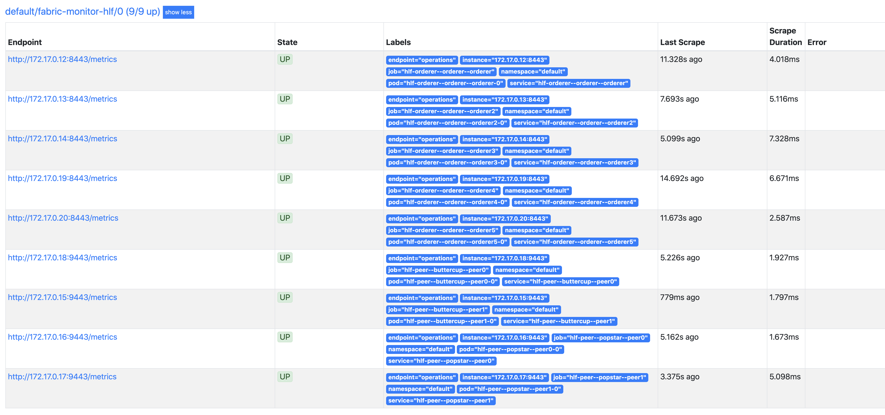
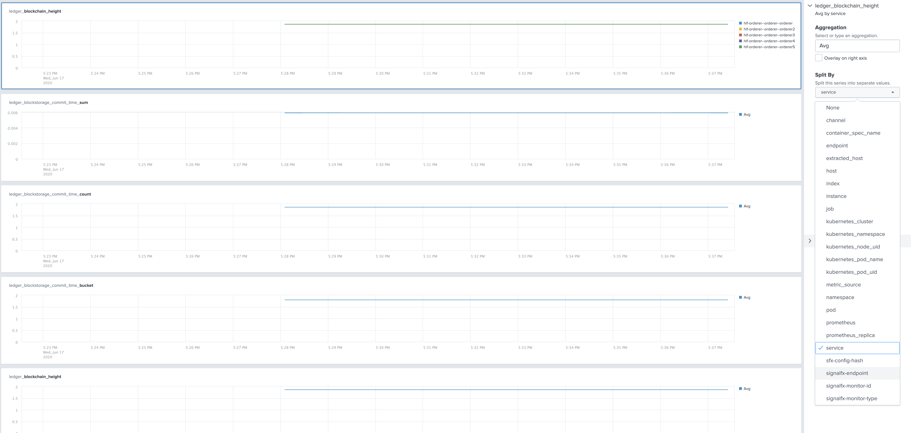

# Hyperledger Fabric meets Kubernetes


* [What is this?](#what-is-this)
* [Requirements](#requirements)
* [Network Architecture](#network-architecture)
* [Launching the network](#launching-the-network)
* [View in Splunk](#view-in-splunk)
* [Generate Transactions](#generate-transactions)


## [What is this?](#what-is-this)
This repository contains a couple of Helm charts to:
* Launch splunk and monitor kubernetes with splunk connect for kubernetes.
* Configure and launch the whole HL Fabric network:
  * A scaled up one, multiple peers per organization and Raft orderers
  * Monitor fabric transactions and events with splunk connect for hyperledger fabric

## [Requirements](#requirements)
* A running Kubernetes cluster, Microk8s should also work
* [HL Fabric binaries](https://hyperledger-fabric.readthedocs.io/en/release-1.4/install.html)
* [Helm](https://github.com/helm/helm/releases/tag/v3.2.1), developed with 3.2.1, newer 3.xx versions should also work
* [jq](https://stedolan.github.io/jq/download/) 1.5+
> `brew install jq`
* [yq](https://pypi.org/project/yq/) 2.6+
> `brew install python-yq`

## [Network Architecture](#network-architecture)

### Scaled Up Raft Network Architecture


**Note:** For transparent load balancing TLS should be disabled. This is only possible for Raft orderers since Fabric 1.4.5. See the [Scaled-up Raft network without TLS](#scaled-up-raft-network-without-tls) sample for details.


## [Launching The Network](#launching-the-network)
First install install splunk chart:
```
./start-splunk.sh
```
Wait for splunk-splunk-kube to start up and go to running.
```
kubectl get pods -w
```

Install the prometheus-operator pod and the associated SignalFx agent, pointed at it:
```
./start-prometheus-operator-signalfx.sh
```

Now, we are ready to launch the network:
```
./start-fabric.sh
```
This chart creates all the above mentioned secrets, pods, services, etc. cross configures them 
and launches the network.

There will be 6 channels created and "splunk_cc" chaincode instantiated.

Congratulations you have a running HL Fabric network in Kubernetes!


## [Generate Transactions](#generate-transactions)

```
kubectl exec hlf-cli -- bash hlf-scripts/random-txns.sh
```

## [View in Splunk](#view-in-splunk)
Get the ip to access your splunk instance.
```
kubectl get services splunk-splunk-kube
```
Navigate to http://{{splunk ip}}:8080/en-US/app/splunk-hyperledger-fabric/introduction

If you are using Minikube, you can expose the service with:
```
minikube service splunk-splunk-kube
```

Login with user admin password changeme


## [Limitations](#limitations)

### TLS

Transparent load balancing is not possible when TLS is globally enabled. So, instead of `Peer-Org`, `Orderer-Org` or `Orderer-LB` services, you need to connect to individual `Peer` and `Orderer` services.

Running Raft orderers without globally enabling TLS is possible since Fabric 1.4.5. See [Scaled-up Raft network without TLS](#scaled-up-raft-network-without-tls) sample for details.

## Troubleshooting Prometheus-operator and SignalFx

In the script you ran earlier, you set up prometheus-operator using a helm chart and associated it with a service monitor.

It is possible you may choose to install prometheus-operator using kube-prometheus or are working with an existing installation.

To help you understand the elements of the stack and debug every step of the collection, we are outlining the detail of the installation.

### Prometheus-operator service monitor

Prometheus-operator uses a service monitor approach to defining additional collection targets.

In our case the service monitor is configured to capture any pod with a label of name component and value `hlf-peer` or `hlf-orderer`:

```yaml
apiVersion: monitoring.coreos.com/v1
kind: ServiceMonitor
metadata:
  name: fabric-monitor-hlf
  namespace: default
  labels:
    app: prometheus-fabric-monitor-hlf
    release: prometheus-operator # This needs to match the prometheus-operator configuration so this service monitor is picked up.
spec:
  selector:
    matchExpressions:
      - {key: component, operator: In, values: [hlf-peer,hlf-orderer]}
  namespaceSelector:
    matchNames:
    - default
  endpoints:
    - port: operations
      interval: 15s
      honorLabels: true
```

You can tailor the selector expression to your own Hyperledger Fabric deployment. To examine the labels of your HLF pods, you can run:
`$> kubectl describe pod hlf-orderer`

In this example, you can first check that prometheus is accepting the service monitor and collecting the metric data by forwarding port 9090:
`$> kubectl port-forward prometheus-prometheus-operator-prometheus-0 9090:9090` then go to http://localhost:9090/targets to see the targets captured by prometheus.

In this sample deployment, the config worked when those targets lit up:


You can also search data by going to localhost:9090 and perform any query you'd like against the data.

### SignalFx monitoring Prometheus

In our example, we capture data from Prometheus with this configuration:

```yaml
  - type: prometheus-exporter
    discoveryRule: kubernetes_pod_name =~ "prometheus-prometheus" && target == "pod"
    host: prometheus
    port: 9090
    metricPath: '/federate?match[]=%7Bendpoint%3D%22operations%22%7D'
    extraDimensions:
      metric_source: prometheus
```
The important part of the config is the expression required by SignalFx to capture metrics [federated](https://prometheus.io/docs/prometheus/latest/federation/) by the Prometheus server.

Note `%7Bendpoint%3D%22operations%22%7D` is an URL encoded [PromQL query](https://prometheus.io/docs/prometheus/latest/querying/basics/), which decoded says `{endpoint="operations"}` meaning any metric coming into Prometheus from the endpoint named operations will be passed on to Splunk.

To make sure SignalFx is properly capturing data from Prometheus, you can troubleshoot with

`$>kubectl exec -it agent-zk52r bash` (replace with your pod name, you can get it from kubectl get pods)

In the shell, type 
`$> signalfx-agent status monitors`

It should show that it is capturing information from prometheus-operator with:

```yaml
13. prometheus-exporter
    Reporting Interval (seconds): 10
    Enabled Metrics: []
    Discovery Rule: kubernetes_pod_name =~ "prometheus-prometheus" && target == "pod"
    Monitored Endpoint ID: prometheus-prometheus-operator-prometheus-0-deec2a5-pod
    Endpoint Dimensions: {container_spec_name: prometheus, kubernetes_pod_name: prometheus-prometheus-operator-prometheus-0, kubernetes_pod_uid: deec2a5c-26bc-45f3-9adb-17712d2a8237, kubernetes_namespace: default}
    Config:
      type: prometheus-exporter
      discoveryRule: kubernetes_pod_name =~ "prometheus-prometheus" && target == "pod"
      validateDiscoveryRule: false
      extraDimensions:
        metric_source: prometheus
      extraSpanTags: 
      extraSpanTagsFromEndpoint: 
      defaultSpanTags: 
      defaultSpanTagsFromEndpoint: 
      extraDimensionsFromEndpoint: 
      configEndpointMappings: 
      intervalSeconds: 10
      solo: false
      datapointsToExclude: 
      disableHostDimensions: false
      disableEndpointDimensions: false
      dimensionTransformations: 
      extraMetrics: 
      extraGroups: 
      httpTimeout: 10000000000
      username: ""
      password: 
      useHTTPS: false
      skipVerify: false
      caCertPath: ""
      clientCertPath: ""
      clientKeyPath: ""
      host: 172.17.0.25
      port: 9090
      useServiceAccount: false
      metricPath: /federate?match[]=%7Bendpoint%3D%22operations%22%7D
      sendAllMetrics: false
```

You can also check the logs of the agent using

`$>kubectl logs agent-xyz`

You can verify it works by opening the metrics workspace in Splunk and looking for incoming metric data.
A good metric is `ledger_blockchain_height`. You can split by quite a few different dimensions, allowing you to see where the data originated.



## [Conclusion](#conclusion)

So happy BlockChaining in Kubernetes :)

And don't forget the first rule of BlockChain club:

**"Do not use BlockChain unless absolutely necessary!"**

*Hakan Eryargi (r a f t)*
